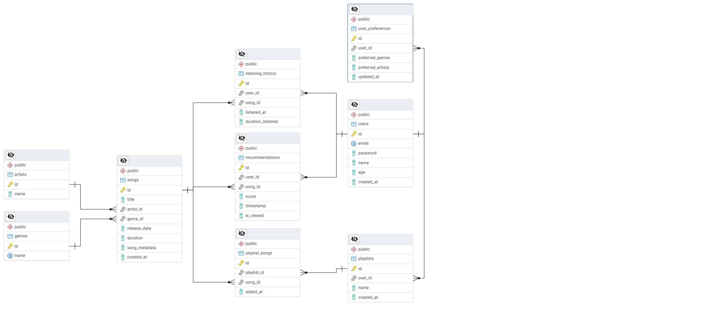

# Database-Management-System
This repository features a database management system project: Music Player

## Overview
This Music Player is a Python-based desktop app built with Tkinter and PostgreSQL.  
It allows users to register, log in, browse songs, create playlists, and receive personalized music recommendations based on their preferences and listening history.

### Features
- User authentication (sign up & login)
- Song and artist management
- Genre classification
- Playlist creation and management
- Listening history tracking
- Smart music recommendations
- PostgreSQL database integration

## 🗃️ Database Tables & Design Rationale

Here’s how we thought about the database for this music player system.

We needed something that could handle user accounts, store songs, remember what people like, and also give them music suggestions based on what they actually listen to. So I broke things down like this:

---

### `users`
This one's obvious. We store the user's email, password, name, and age.  
Also added a `created_at` column just to keep track of when someone signed up.

---

### `songs`, `artists`, `genres`
Every song has an artist and a genre, right?  
So instead of writing the artist name again and again in every song row, we made separate tables for `artists` and `genres`, and linked them using foreign keys.

It makes the data cleaner and easier to manage later on.

---

### `user_preferences`
We wanted to save what kind of songs a user actually likes — things like favorite genres and artists.  
Since it’s more of a list (and can be different for everyone), we used JSON fields here to store that data easily without creating extra tables.

---

### `listening_history`
This table logs what a user listens to, when they played it, and for how long.  
Useful for understanding their behavior and building recommendations based on real usage, not just what they say they like.

---

### `recommendations`
When our system gives song suggestions to a user, we save them here.  
We log the `score` (like how good the match is) and whether the user actually saw the recommendation (`is_viewed`).

---

### `playlists` and `playlist_songs`
Users can make playlists. So:
- `playlists` stores which user created which playlist
- `playlist_songs` connects songs to playlists (many-to-many setup)

---

### Why this structure?
- We normalized repeating stuff (like genres/artists) to make things cleaner.
- We used foreign keys to link stuff together properly.
- We went with JSON for things like preferences because it’s easier to handle messy data like that.
- And yeah, the goal was to keep things smart but simple so it’s easy to plug into the Tkinter GUI and do cool stuff like recommendations and playlist management.

## Entity-Relationship Diagram (ERD)

Here's the ERD showing how all the tables in the database are connected:

